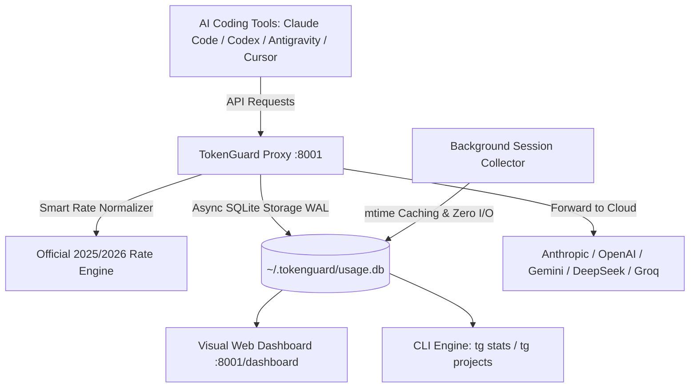

# 🛡️ TokenGuard

<p align="center">
  <b>The Local-First AI Cost Intelligence & Real-Time Context Guard for AI Coding Tools</b>
</p>

<p align="center">
  <a href="https://pypi.org/project/tokenguard/"></a>
  <a href="LICENSE"></a>
  <a href="https://github.com/richardlhcai2-svg/TokenGuard"></a>
  <a href="https://github.com/richardlhcai2-svg/TokenGuard"></a>
</p>

<p align="center">
  [ <b>English</b> ] · [ <a href="README.zh-CN.md">简体中文</a> ]
</p>

---

## 💡 What is TokenGuard?

When using AI coding assistants like **Claude Code**, **ChatGPT Codex**, **Antigravity (Gemini)**, **Cursor**, or **Windsurf**, developers face two massive blind spots:
1. **Unclear Project Costs**: Bills arrive as a giant single sum with zero visibility into which specific Git repository, client, or workspace consumed the budget.
2. **Context Window Blowouts**: Sessions silently swell into hundreds of thousands of tokens, triggering expensive compacting, performance degradation, and surprise bills.

**TokenGuard** is an ultra-lightweight, zero-latency local proxy and background monitor that automatically tracks token consumption, calculates exact costs (including prompt caching discounts), attributes spend to individual Git projects, and visualizes real-time Context Stress dials.

```bash
pip install tokenguard
tg serve
```

---

## ✨ Key Features

- 📁 **Project & Workspace Cost Attribution**: Automatically detects active Git repositories and workspace directories (`socialmind-ai`, `tokenguard`, etc.), providing exact lifetime and daily cost breakdowns per project.
- ⚡ **Real-Time Context Stress Dials**: Live 0–100% dial with threshold warnings (Safe, Warning, Critical/Compact Risk) for Claude Code, Antigravity, and Codex sessions.
- 💰 **Universal 2025/2026 Model Catalog & Cache Discounts**: Pre-calibrated official rates for:
  - **Anthropic Claude**: Sonnet 3.7/3.5, Opus 3/4/5, Haiku 3.5 (90% prompt cache read discount applied).
  - **Google Gemini**: Flash 3.7/2.5/2.0 ($0.10/1M in, $0.40/1M out), Pro 2.5/3.1 (75% context cache discount).
  - **OpenAI / Codex**: GPT-5.6 Sol ($5/$15), GPT-4o, o1, o3-mini, o4 (50% cache discount).
  - **DeepSeek**: V3 / V4-Flash ($0.27/$1.10, Cache Hit $0.07), R1 / V4-Pro Reasoner ($0.55/$2.19).
  - **Groq Cloud**: Llama 3.3 70B ($0.59/$0.79), Llama 3.1 8B, Mixtral 8x7B, Gemma 2 9B, DeepSeek-R1 Distill.
  - **Moonshot Kimi**: K3 ($0.50/$1.50), K3-Free ($0.00), Moonshot-v1 series.
  - **Zhipu AI (GLM)**: GLM-5.2, GLM-4-Plus ($0.80/$1.60), GLM-4-Air, GLM-4-Flash ($0.00), GLM-4-Long (1M context).
  - **Alibaba Qwen**: Qwen 2.5 72B / 32B / Coder / Max / Plus / QwQ-32B.
- 🖥️ **Commercial-Grade Visual Web Dashboard**: Standalone dark-glassmorphism dashboard with 3 dedicated views:
  1. `[⚡ Realtime Dials]`: Live context stress, today's budget vs. burn rate, token velocity.
  2. `[📁 Projects Attribution Studio]`: Dedicated project-level breakdown with lifetime spend, token counts, and request stats.
  3. `[📡 Stream Trace]`: Real-time request log with latency and cost per call.
- 📟 **Rich Interactive Terminal CLI**: Live updating CLI dashboard with `tg stats --watch` and `tg projects`.
- 🪶 **Near-Zero System Footprint**: Powered by SQLite in WAL mode with intelligent file modification caching (`<0.1% CPU`, `~50MB RAM`).
- 🔒 **100% Privacy & Local-First**: All data stays on your local machine (`~/.tokenguard/usage.db`). No cloud tracking, zero external telemetry.

---

## 🚀 Quick Start (5 Minutes)

### 1. Installation
```bash
pip install tokenguard
```

### 2. Interactive Setup Wizard
```bash
tg quickstart
```

### 3. Start the Background Proxy
```bash
tg serve
```
TokenGuard starts a local proxy on `http://localhost:8001` with an embedded dashboard at `http://localhost:8001/dashboard`.

### 4. Configure Your AI Coding Tools

| Setting | Value |
|---|---|
| **Base URL** | `http://localhost:8001` |
| **Auth Header** | `x-tokenguard-key: <your-proxy-secret>` |
| **Provider Header** | `x-anthropic-key` / `x-openai-key` / `x-gemini-key` / `x-deepseek-key` *(or configured via `tg config`)* |

---

## 💻 CLI Commands Reference

| Command | Description |
|---|---|
| `tg serve` | Start the standalone proxy daemon and visual dashboard on port 8001 |
| `tg dashboard` | Launch the web dashboard in your default browser |
| `tg stats` | Display token usage and cost summary in terminal |
| `tg stats --watch` | Live-updating terminal dashboard (1s refresh) |
| `tg projects` | Show all-time Project & Workspace Cost Attribution table |
| `tg config` | View and manage local API keys and proxy configuration |
| `tg quickstart` | Run the interactive onboarding wizard |
| `tg --help` | Show help and all available CLI flags |

---

## 📁 Project Cost Attribution in Action

```text
╭────────────── 📁 Project Cost Attribution (All-Time Lifetime) ───────────────╮
│                📁 AI Cost Attribution by Project / Workspace                 │
│  Project /                                                                   │
│  Workspace             Spent  Share         Tokens  Calls  Last Active       │
│  📁 socialmind-ai    $401.57  38.4%  2,962,375,275  30324  2026-08-30 15:05  │
│  📁 Panstone         $203.71  19.5%     35,912,380    118  2026-08-30 14:31  │
│  📁 AiforFA          $102.36   9.8%    797,240,913   8457  2026-08-30 02:43  │
│  📁 EngineeringOS     $64.94   6.2%    424,191,128   4386  2026-08-21 20:55  │
│  📁 tokenguard        $27.18   2.6%    258,985,816   1046  2026-08-30 16:33  │
╰──────────────────────────────────────────────────────────────────────────────╯
```

---

## 🛠️ Architecture



---

## 📄 License

This project is licensed under the [MIT License](LICENSE).
